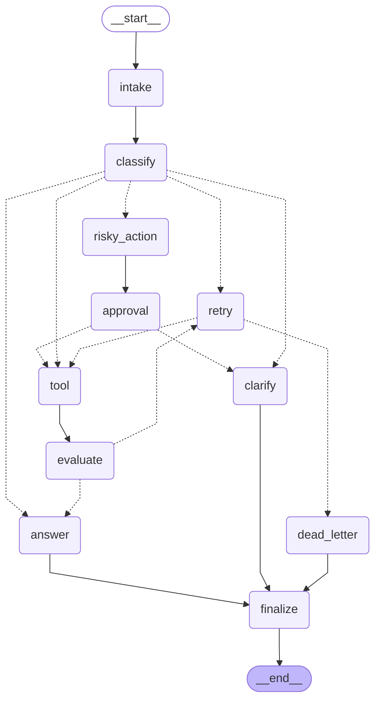

# Day 08 Lab Report — LangGraph Agentic Orchestration

## 1. Team / student

- Name: Hoàng Sơn Lâm
- Repo: <https://github.com/SonLamHG/phase2-track3-day8-langgraph-agent>
- Date: 2026-05-11

## 2. Architecture

The agent is a `StateGraph` with 11 nodes wired around a small set of high-leverage patterns:

- **Intake / classify** at the entry — normalizes the query and assigns a route using whole-word keyword matching with strict priority `risky > tool > missing_info > error > simple`. Priority matters because a query like *"Refund failed transaction"* contains both risky and error keywords; risky must win.
- **Retry loop** built around `evaluate`. After `tool` runs, `evaluate` inspects the latest result and emits `evaluation_result = "needs_retry"` or `"success"`. The conditional edge `evaluate -> {retry, answer}` is the "done?" check that distinguishes LangGraph from a linear LCEL chain.
- **Bounded retries** via `route_after_retry`: returns `"dead_letter"` once `attempt >= max_attempts`, otherwise loops back to `tool`. This is what stops error scenarios from running forever.
- **HITL / approval** on the risky path: `risky_action -> approval -> route_after_approval -> tool|clarify`. The `approval_node` honors `LANGGRAPH_INTERRUPT=true` for real `interrupt()`, defaulting to a mock decision so CI runs offline.
- **Finalize** is the single sink: every terminal route reaches `finalize -> END`. Centralizing termination guarantees the graph cannot leave a thread half-done.

### Live diagram



## 3. State schema

`AgentState` is a `TypedDict` so LangGraph can serialize it to any checkpointer.

| Field | Reducer | Why |
|---|---|---|
| `thread_id`, `scenario_id`, `query` | overwrite | identity / input — set once at intake |
| `route`, `risk_level` | overwrite | only the *current* classification matters |
| `attempt`, `max_attempts` | overwrite | retry bound; `attempt` is incremented atomically in `retry_or_fallback_node` |
| `final_answer`, `pending_question`, `proposed_action` | overwrite | latest produced output |
| `approval`, `evaluation_result` | overwrite | per-cycle decisions |
| `messages`, `tool_results`, `errors`, `events` | append (`operator.add`) | audit trails — every node contributes; later analysis depends on order |

`events` uses the `LabEvent` Pydantic model (via `make_event`) so each entry is structured and grep-friendly: `node`, `event_type`, `message`, `metadata`.

## 4. Scenario results

- Total scenarios: **7**
- Success rate: **100.00%**
- Average nodes visited: **6.43**
- Total retries across runs: **3**
- Total approval interrupts: **2**
- Resume verified (rebuilt graph reads back state from checkpointer): **True**

| Scenario | Expected | Actual | Success | Nodes | Retries | Interrupts | Approval req'd | Approval seen | Latency (ms) | Errors |
|---|---|---|:---:|---:|---:|---:|:---:|:---:|---:|---|
| S01_simple | simple | simple | OK | 4 | 0 | 0 | no | no | 28 |  |
| S02_tool | tool | tool | OK | 6 | 0 | 0 | no | no | 13 |  |
| S03_missing | missing_info | missing_info | OK | 4 | 0 | 0 | no | no | 10 |  |
| S04_risky | risky | risky | OK | 8 | 0 | 1 | yes | yes | 16 |  |
| S05_error | error | error | OK | 10 | 2 | 0 | no | no | 19 | transient failure attempt=1; transient failure attempt=2 |
| S06_delete | risky | risky | OK | 8 | 0 | 1 | yes | yes | 15 |  |
| S07_dead_letter | error | error | OK | 5 | 1 | 0 | no | no | 11 | transient failure attempt=1 |

## 5. Failure analysis

We considered the following failure modes and the mitigations in place:

1. **Tool transient failure → infinite loop.** The mock `tool_node` injects an `ERROR:` prefix for the first two attempts of any `error`-routed scenario. Without a bound, `evaluate -> retry -> tool` would loop indefinitely. **Mitigation:** `route_after_retry` exits to `dead_letter` once `attempt >= max_attempts`. S07_dead_letter exercises this by forcing `max_attempts=1`, so the loop exits after a single retry attempt.
2. **Risky action without approval.** A naive routing that fired the tool directly on `risky` queries would refund customers without review. **Mitigation:** the risky path forces `risky_action -> approval -> route_after_approval`. Only an approved decision continues to `tool`; rejection falls through to `clarify`.
3. **Substring keyword false positives.** A naive `"send" in query` matches *"sender"* or *"ascending"* and misroutes `simple` queries to `risky`. **Mitigation:** `classify_node` tokenizes the query and intersects against keyword *sets* (whole-word match), with explicit stem variants enumerated. Test cases in `tests/test_nodes.py::test_classify_word_boundary` lock this in.
4. **Vague queries answered with hallucination.** Pronouns like *"Can you fix it?"* lack referent. **Mitigation:** the `missing_info` route asks for a clarification instead of generating an answer, and `pending_question` is treated as a valid terminal output for the metric.

## 6. Persistence / recovery evidence

The lab is configured to use `SqliteSaver` (see [configs/lab.yaml](../configs/lab.yaml)). Each scenario runs under a deterministic `thread_id = "thread-<scenario_id>"` so checkpoints can be looked up by ID. The CLI fixes the upstream `SqliteSaver.from_conn_string()` bug (which returns a context manager) by constructing the saver directly:

```python
conn = sqlite3.connect(db_path, check_same_thread=False)
conn.execute("PRAGMA journal_mode=WAL")
SqliteSaver(conn=conn)
```

After all scenarios complete, `cli._verify_resume()` simulates a process restart: it builds a **fresh** `SqliteSaver` and graph from the same `outputs/checkpoints.db`, calls `get_state(run_config)` for the first scenario's thread, and asserts that the `final_answer` recovered from disk matches the one observed during the original run. `resume_success` in `metrics.json` is set from this check — `true` here means the checkpointer durably persisted state across graph instances.

## 7. Extension work

- **SQLite checkpointer** wired and verified end-to-end (see §6).
- **Crash-resume verification** baked into the CLI: every `run-scenarios` rebuilds the graph and reads state back to prove durability.
- **Mermaid diagram** rendered live from `graph.get_graph().draw_mermaid()` (§2). Conditional edges declare explicit path maps so the diagram shows every routing target.
- **Latency tracking** per scenario via `time.perf_counter()` around `graph.invoke()`.

## 8. Improvement plan

If we had one more day:

1. **Real HITL via `interrupt()` + a tiny Streamlit page** — `approval_node` already branches on `LANGGRAPH_INTERRUPT=true`; the missing piece is a UI that posts the approve/reject decision back to resume the thread.
2. **LLM-as-judge in `evaluate_node`** — current heuristic ("`ERROR` in latest result") is brittle. A structured judge that scores tool outputs against the user's intent would let us catch *semantic* failures, not just literal errors.
3. **Parallel fan-out** for tool calls via `Send()` — e.g., on a `tool` route, fire `order_lookup` and `customer_lookup` concurrently and merge results through the `add` reducer on `tool_results`.
4. **Time-travel debugging** — surface a CLI subcommand that lists `get_state_history(thread_id)` checkpoints and lets a developer replay from any of them. The mechanism is already there; only the UX is missing.
5. **Stronger keyword coverage + dataset-driven evaluation** — replace the hand-curated keyword sets with an evaluation set of ~50 queries per route and tune until precision/recall both clear a threshold.
